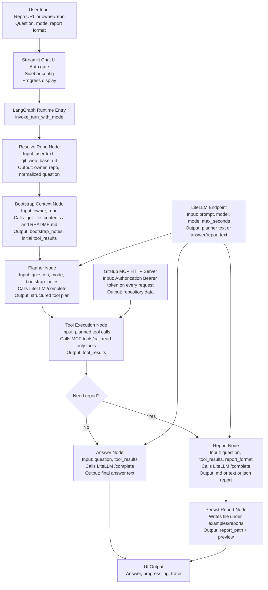

Agent Architecture
==================

Author: `Babak.ea`

This document shows how the Streamlit chat UI, the LangGraph agent, the LiteLLM endpoint, and the GitHub MCP server interact.

Detailed Node Description
-------------------------

1. User Input

- Input:
  - repository URL or `owner/repo`
  - natural-language question
  - selected agent mode
  - selected report format
- Output:
  - chat turn request sent to the Streamlit UI

2. Streamlit Chat UI

- Input:
  - chat text
  - bearer token for the active backend
  - LiteLLM endpoint and model settings
  - `GIT_WEB_BASE_URL`
- Output:
  - a runtime call into `invoke_turn_with_mode`
  - live progress updates rendered back to the user

3. Resolve Repo Node

- Input:
  - raw user message
  - previous repo hint if available
  - `git_web_base_url`
- Output:
  - normalized `owner`
  - normalized `repo`
  - `repo_hint`
  - cleaned `question`

4. Bootstrap Context Node

- Input:
  - `owner`
  - `repo`
- MCP calls:
  - `get_file_contents` for `/`
  - `get_file_contents` for `README.md`
- Output:
  - root structure notes
  - README context
  - initial `tool_results`

5. Planner Node

- Input:
  - normalized question
  - agent mode instructions
  - bootstrap context
  - list of allowed read-only MCP tools
- LiteLLM output:
  - JSON plan with `needs_report`, `analysis_focus`, and `tool_calls`
- Fallback:
  - deterministic plan if the model output is not valid JSON

6. Tool Execution Node

- Input:
  - planned MCP tool calls
  - bearer token
- Behavior:
  - sends the bearer token on every MCP request
  - runs only allowed read-only tools
- Output:
  - accumulated `tool_results`

7. Answer Node

- Input:
  - question
  - agent mode
  - collected tool evidence
- Output:
  - concise answer text for normal chat responses

8. Report Node

- Input:
  - question
  - tool evidence
  - selected report format: `md`, `text`, or `json`
- Output:
  - formatted report content

9. Persist Report Node

- Input:
  - generated report content
  - selected report format
- Output:
  - file path under `examples/reports`
  - preview text returned to the UI

10. UI Output

- Output shown to the user:
  - final answer or report preview
  - progress log
  - optional trace
  - download button for generated report files